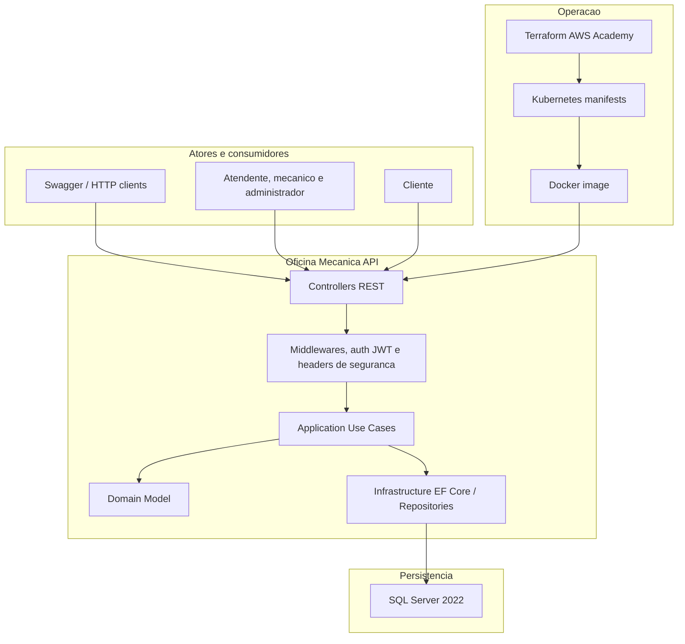

# C4 Container

```mermaid
flowchart TB
    subgraph Cliente["Atores e consumidores"]
        browser["Swagger / HTTP clients"]
        operadores["Atendente, mecanico e administrador"]
        cliente["Cliente"]
    end

    subgraph Api["Oficina Mecanica API"]
        controllers["Controllers REST"]
        middleware["Middlewares, auth JWT e headers de seguranca"]
        application["Application Use Cases"]
        domain["Domain Model"]
        infrastructure["Infrastructure EF Core / Repositories"]
    end

    subgraph Dados["Persistencia"]
        sql["SQL Server 2022"]
    end

    subgraph Operacao["Operacao"]
        docker["Docker image"]
        k8s["Kubernetes manifests"]
        terraform["Terraform AWS Academy"]
    end

    browser --> controllers
    operadores --> controllers
    cliente --> controllers
    controllers --> middleware
    middleware --> application
    application --> domain
    application --> infrastructure
    infrastructure --> sql
    docker --> controllers
    k8s --> docker
    terraform --> k8s
```

## Leitura

A API segue Clean Architecture em um monolito modular. A camada de dominio permanece independente de HTTP, banco de dados e infraestrutura.
