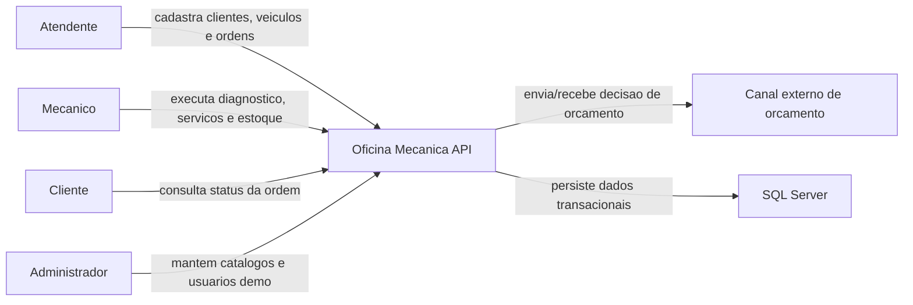

# C4 Contexto

```mermaid
flowchart LR
    atendente["Atendente"]
    mecanico["Mecanico"]
    cliente["Cliente"]
    admin["Administrador"]
    canal["Canal externo de orcamento"]
    sistema["Oficina Mecanica API"]
    banco["SQL Server"]

    atendente -->|"cadastra clientes, veiculos e ordens"| sistema
    mecanico -->|"executa diagnostico, servicos e estoque"| sistema
    cliente -->|"consulta status da ordem"| sistema
    admin -->|"mantem catalogos e usuarios demo"| sistema
    sistema -->|"envia/recebe decisao de orcamento"| canal
    sistema -->|"persiste dados transacionais"| banco
```

## Leitura

O sistema centraliza o fluxo operacional da oficina, expondo API REST para perfis internos e consulta publica de status para o cliente.
