# Deployment

```mermaid
flowchart TB
    subgraph LocalCompose["Docker Compose local"]
        composeUser["Usuario local"]
        composeApi["Container API :5093"]
        composeDb["Container SQL Server :14333"]
        composeUser --> composeApi
        composeApi --> composeDb
    end

    subgraph LocalK8s["Kubernetes local - Docker Desktop"]
        ingress["NGINX Ingress / port-forward"]
        svcApi["Service oficina-api"]
        podApi["Deployment oficina-api"]
        hpa["HPA oficina-api-hpa"]
        svcDb["Service sqlserver"]
        podDb["Deployment sqlserver"]
        pvc["PVC sqlserver"]
        ingress --> svcApi
        svcApi --> podApi
        hpa --> podApi
        podApi --> svcDb
        svcDb --> podDb
        podDb --> pvc
    end

    subgraph AwsAcademy["AWS Academy - caminho modelado no Terraform"]
        ghcr["GHCR ou ECR"]
        vpc["VPC"]
        publicSubnets["Subnets publicas"]
        privateSubnets["Subnets privadas"]
        eks["Amazon EKS"]
        nodes["Managed Node Group"]
        rds["Amazon RDS SQL Server"]
        lb["Load Balancer"]
        terraform["Terraform plan/apply/destroy"]

        terraform --> vpc
        terraform --> ghcr
        vpc --> publicSubnets
        vpc --> privateSubnets
        publicSubnets --> lb
        privateSubnets --> eks
        eks --> nodes
        nodes --> rds
        ghcr --> nodes
        lb --> eks
    end
```

## Leitura

O projeto suporta execucao local simples via Docker Compose, validacao operacional em Kubernetes local e um caminho AWS modelado por Terraform. Em AWS Academy, qualquer `apply` exige aprovacao e `destroy` obrigatorio.
