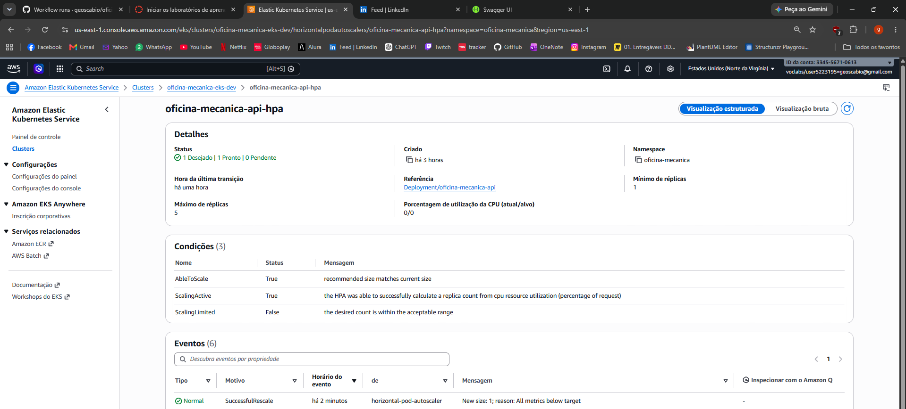
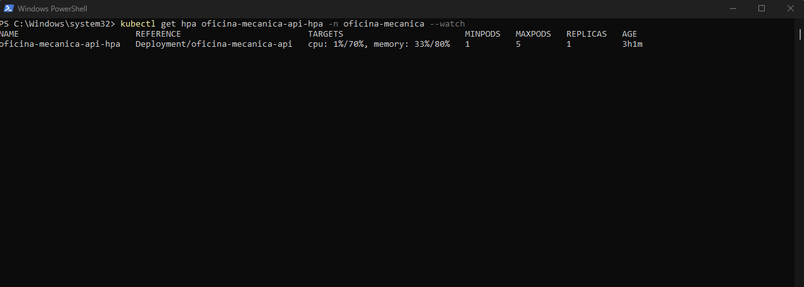
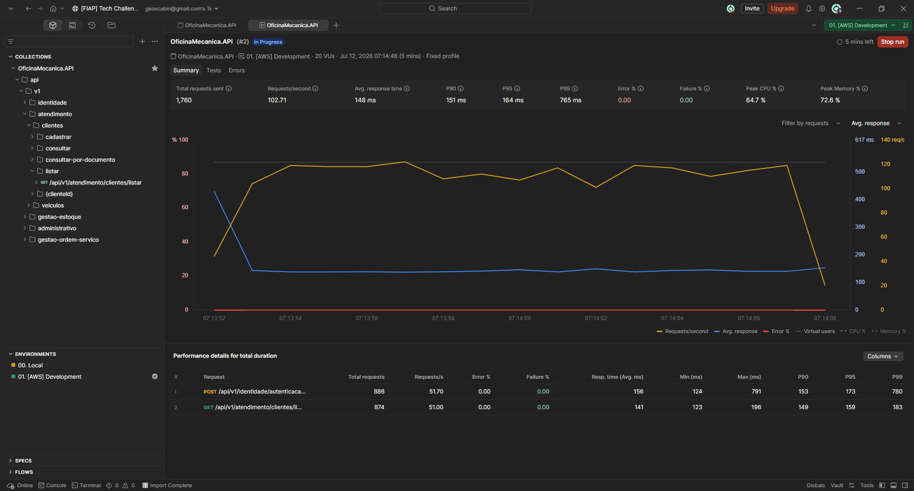
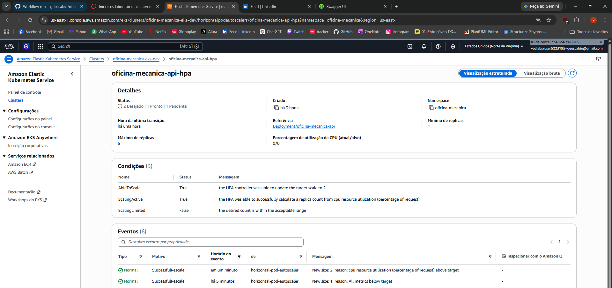
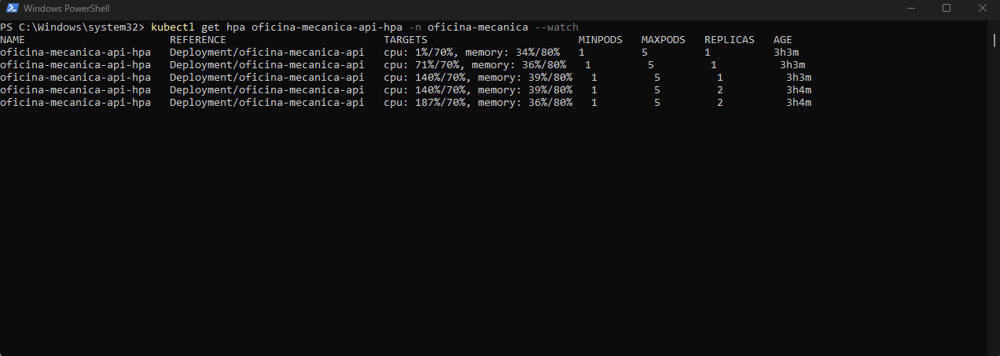
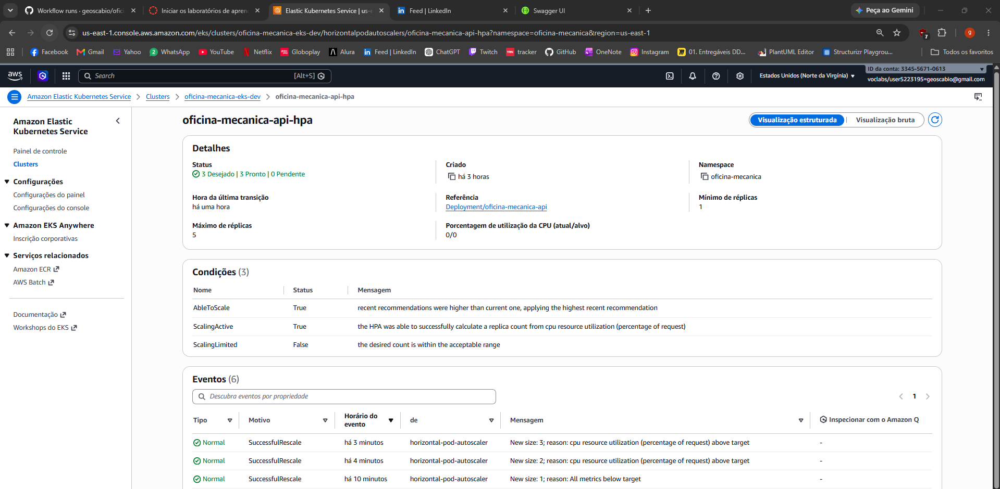
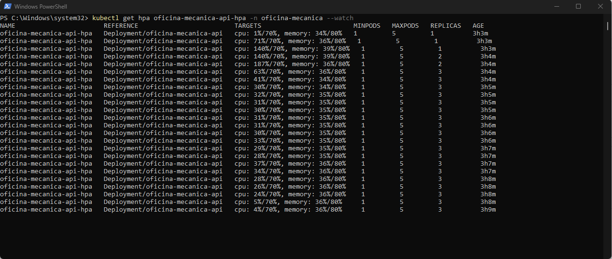
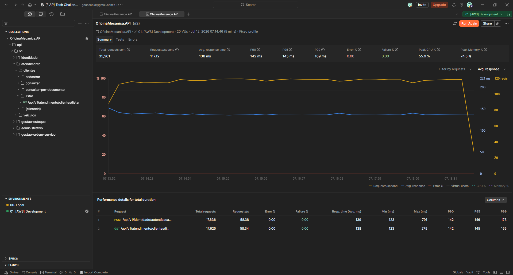
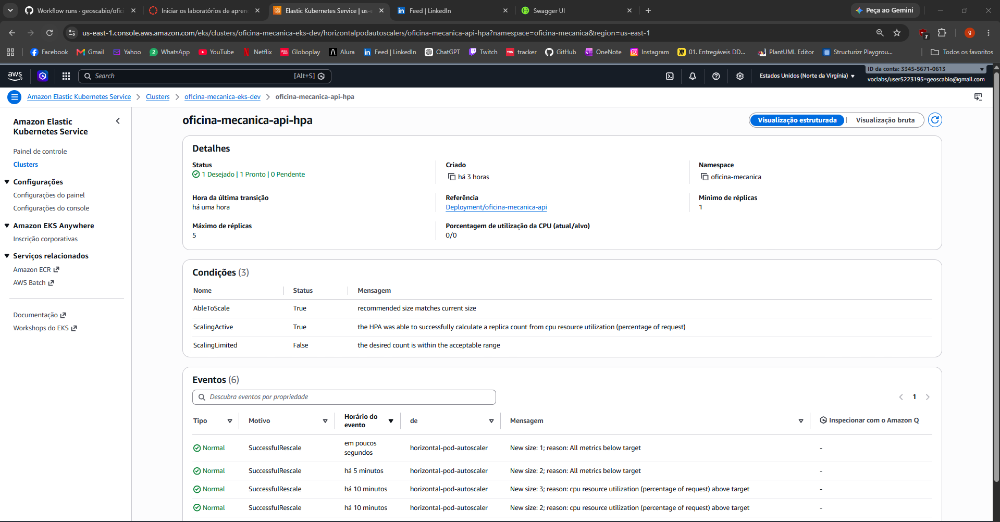
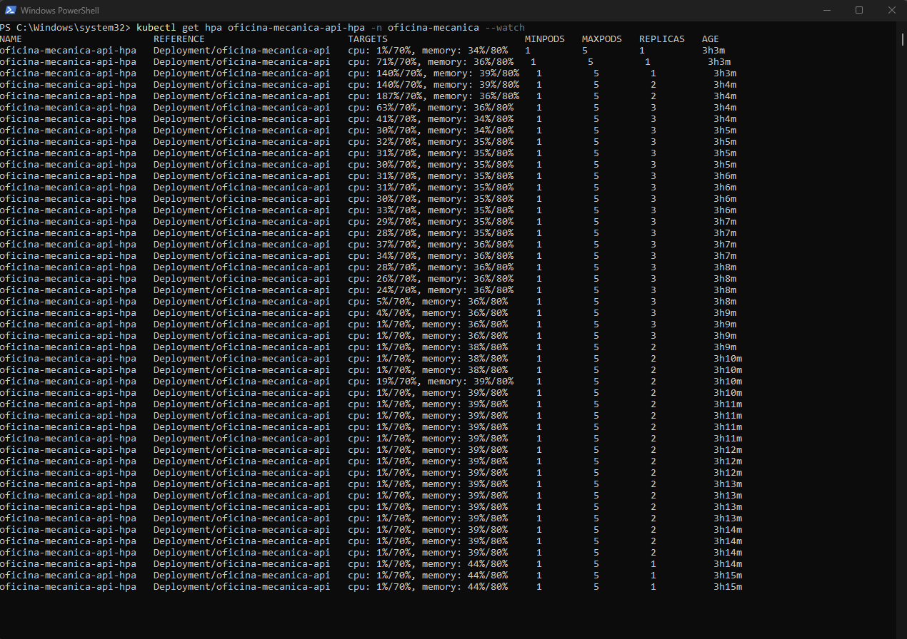

# Evidencia: Kubernetes HPA (autoscaling)

Este arquivo documenta a validacao real do `HorizontalPodAutoscaler` (HPA) da API contra o ambiente publicado na AWS (`oficina-mecanica-eks-dev`).

## Configuracao do HPA

| Campo | Valor |
| --- | --- |
| HPA | `oficina-mecanica-api-hpa` |
| Namespace | `oficina-mecanica` |
| Replicas minimas | 1 |
| Replicas maximas | 5 |
| CPU target | 70% de `requests.cpu` |
| Memory target | 80% de `requests.memory` |

## Metodologia

Diferente de um teste de carga interno ao cluster (ex.: pod `busybox` em loop), a carga foi gerada de fora, contra o Load Balancer publico da API, usando o **Postman Performance Test** (Collection Runner) com o mesmo baseline de autenticacao (`login`) e uma rota de leitura (`listar clientes`) — ambas leves e idempotentes, para nao gerar dados falsos no banco de demonstracao. Configuracao: `20 Virtual Users`, perfil `Fixed`, `5 minutos` de duracao, contra o ambiente `01. [AWS] Development`.

Em paralelo, o comportamento do HPA foi observado por dois caminhos independentes e cruzados entre si:

- `kubectl get hpa oficina-mecanica-api-hpa -n oficina-mecanica --watch` (terminal local, historico continuo).
- AWS Console (`EKS > oficina-mecanica-eks-dev > Resources > HorizontalPodAutoscalers > oficina-mecanica-api-hpa`), incluindo a secao de Eventos do Kubernetes (`SuccessfulRescale`).

O ciclo documentado abaixo e **100% organico**: nenhuma replica foi forcada manualmente durante a captura final. O ambiente partiu de `1 replica` em repouso, escalou sob carga real, e desceu sozinho de volta para `1` apos o fim do teste, respeitando a janela de estabilizacao padrao do HPA (maior recomendacao dos ultimos 5 minutos, para evitar oscilacao).

## Resultado real

| Momento | Replicas | CPU (atual/alvo) | Memory (atual/alvo) | Evento |
| --- | --- | --- | --- | --- |
| Antes (baseline) | 1 | 1%/70% | 33%/80% | `New size: 1; reason: All metrics below target` |
| Durante (pico) | 1 -> 2 | ate 187%/70% | ~39%/80% | `New size: 2; reason: cpu resource utilization above target` |
| Apos (estabilizado) | 3 | 63%/70% caindo | ~35%/80% | `New size: 3; reason: cpu resource utilization above target` |
| Depois (downscale natural) | 3 -> 2 -> 1 | 1%/70% | 44%/80% | `New size: 1; reason: All metrics below target` |

Teste de carga (Postman Performance Test, run completo):

| Campo | Valor |
| --- | --- |
| Total de requisicoes enviadas | 35.261 |
| Requests/segundo (media) | ~117 |
| Erro | 0,00% |
| Falha | 0,00% |

## Evidencia visual

### Antes — ambiente em repouso, 1 replica

### Inicio do teste de carga (Postman)

### Durante — escalando sob carga real

### Apos — pico estabilizado em 3 replicas

### Termino do teste de carga (Postman)

### Depois — downscale natural, volta para 1 replica

