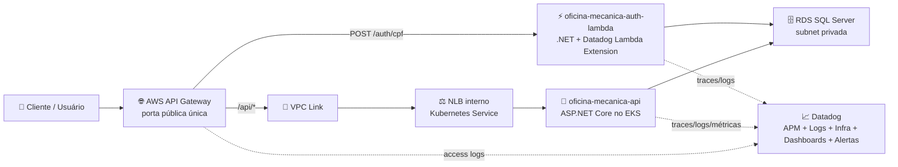
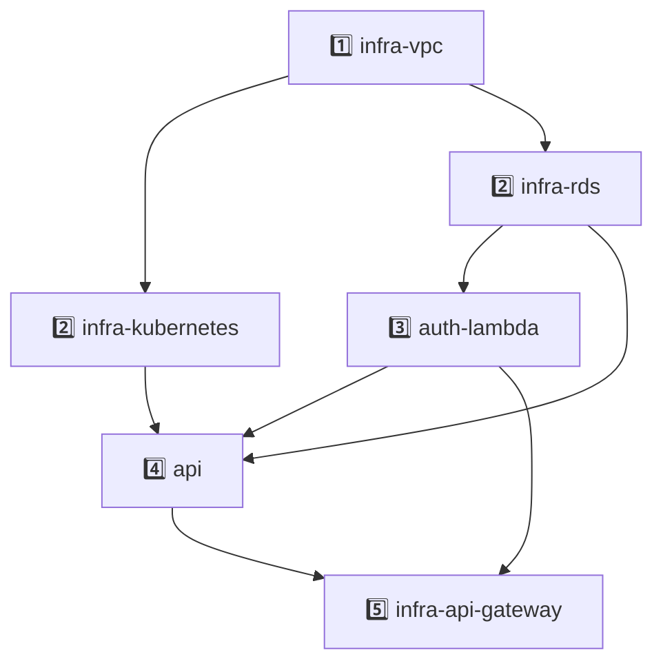

# 🚀 Fase 3 — Plano Final de Execução

> Plano fechado para executar a Fase 3 do Tech Challenge mantendo o caminho das Fases 1 e 2: simples, bem estruturado, rastreável, documentado e sem overengineering.

---

## 🎯 Objetivo

Elevar a solução da oficina mecânica para um cenário mais próximo de operação corporativa, cobrindo:

- 🔐 Autenticação por CPF com Function Serverless.
- 🌐 API Gateway como porta única de entrada.
- ☸️ Aplicação principal executando em Kubernetes.
- 🗄️ Banco de dados gerenciado em RDS.
- 📈 Observabilidade com Datadog.
- 🧱 Infraestrutura como código com Terraform.
- 🔁 CI/CD claro, separado por recurso e com controle robusto de `apply`/`destroy`.
- 📚 Documentação arquitetural completa para explicar decisões, fluxos e operação.

---

## 🧭 Princípios do Plano

- ✅ **Básico bem feito:** implementar apenas o necessário para cumprir a Fase 3 com qualidade.
- 🧼 **Clean Code e Clean Architecture:** manter regras de negócio protegidas de detalhes de infraestrutura.
- 🧩 **Separação de responsabilidades:** cada esteira tem um motivo claro para existir.
- 🏷️ **Nomes fiéis ao recurso:** usar `vpc`, `rds`, `kubernetes`, `api-gateway`, `auth-lambda` e `api`.
- 🛡️ **Segurança por padrão:** API Gateway será a única entrada pública.
- 📊 **Observabilidade real:** logs, traces, métricas, dashboards e alertas com Datadog.
- 🔎 **Rastreabilidade ponta a ponta:** usar `X-Correlation-Id` funcional e `dd.trace_id` técnico.
- 🧨 **Destroy controlado:** destruir na ordem correta, com guardrails e validação real na AWS.

---

## 📦 Entregáveis Oficiais e Esteiras

O enunciado pede 4 entregáveis obrigatórios. O plano mantém esses 4 entregáveis, mas organiza a implementação em 6 repositórios/esteiras para deixar responsabilidades e deploys mais claros.

| Esteira / Repositório | Responsabilidade | Mapeamento no enunciado |
| --- | --- | --- |
| `oficina-mecanica-infra-vpc` | VPC, subnets, rotas, NAT/IGW e security groups base | Base técnica compartilhada |
| `oficina-mecanica-infra-rds` | RDS SQL Server, subnet group, security group do banco e outputs | Infraestrutura do banco gerenciado |
| `oficina-mecanica-infra-kubernetes` | EKS, node group, ECR e Datadog Agent/Cluster Agent | Infraestrutura Kubernetes |
| `oficina-mecanica-auth-lambda` | Lambda .NET de autenticação por CPF e emissão de JWT | Function Serverless |
| `oficina-mecanica-api` | Aplicação principal, Docker, manifests Kubernetes, migrations e Swagger/Postman | Aplicação principal em Kubernetes |
| `oficina-mecanica-infra-api-gateway` | API Gateway, VPC Link, rotas públicas e logs de acesso | API Gateway para controle e roteamento |

> 📌 Na documentação da entrega, isso será descrito como **4 entregáveis obrigatórios organizados em esteiras separadas por recurso**, não como excesso sobre o enunciado.

---

## 🏗️ Arquitetura Alvo



### Decisões fechadas

- 🌐 **API Gateway será a única porta pública.**
- 🔒 **Load Balancer do EKS será interno**, não público.
- 🔗 **API Gateway acessará a API via VPC Link + NLB interno.**
- ⚡ **Lambda será .NET**, em repositório próprio.
- 🪪 **Autenticação será por CPF**, consultando existência e status do cliente no RDS.
- 🎫 **Lambda emitirá JWT**, e a API continuará validando o token com `[Authorize]`.
- 🚫 **Não usar Lambda Authorizer no MVP.** Ele fica como melhoria futura opcional se a banca pedir validação também na borda do Gateway.
- 📈 **Datadog será a ferramenta única de observabilidade.**
- 🧵 **Usar Datadog nativo**, sem adicionar OpenTelemetry no escopo principal.

---

## 🔐 Autenticação por CPF

### Fluxo

1. Cliente chama `POST /auth/cpf` no API Gateway.
2. API Gateway encaminha para `oficina-mecanica-auth-lambda`.
3. Lambda valida o formato do CPF.
4. Lambda consulta o cliente no RDS.
5. Lambda verifica se o cliente existe e está ativo.
6. Lambda gera JWT com perfil `Cliente`.
7. Cliente usa o JWT nas rotas protegidas em `/api/*`.
8. API valida o JWT normalmente via middleware ASP.NET Core.

### Claims mínimas do JWT

- `sub`: identificador do cliente.
- `cpf_hash`: hash ou representação mascarada do CPF.
- `cliente_id`: identificador interno do cliente.
- `role`: `Cliente`.
- `jti`: identificador único do token.
- `iss`, `aud`, `exp`: emissor, audiência e expiração.

### Mudanças na aplicação

- Adicionar status ao cliente, por exemplo `StatusCliente`.
- Criar migration para refletir o novo campo.
- Atualizar seed/demo com clientes ativos e inativos.
- Garantir que nenhuma rota sensível dependa apenas do Gateway: a API continua validando JWT.

---

## 🌐 API Gateway

### Rotas

| Rota | Destino | Autenticação |
| --- | --- | --- |
| `POST /auth/cpf` | Lambda .NET | Pública, com validação dentro da Lambda |
| `/api/*` | API no EKS via VPC Link + NLB interno | JWT validado pela API |

### Por que VPC Link?

Usar VPC Link evita que alguém acesse a API diretamente pelo Load Balancer, pulando o Gateway. Assim, a arquitetura fica mais simples de explicar:

> O mundo externo fala apenas com o API Gateway. A API fica privada dentro da VPC.

### Ajuste necessário no Kubernetes

O `Service` da API deve criar um **NLB interno**, não um Load Balancer público. A esteira da API deve publicar no SSM os dados necessários para o API Gateway, como:

- `/oficina-mecanica/development/api/nlb_dns_name`
- `/oficina-mecanica/development/api/nlb_listener_arn`
- `/oficina-mecanica/development/status/api`

---

## 📈 Observabilidade com Datadog

### Componentes

- ☸️ **Datadog Agent/Cluster Agent no EKS:** métricas de Kubernetes, pods, nodes e logs da API.
- ⚡ **Datadog Lambda Extension:** métricas, logs e traces da Lambda.
- 🌐 **API Gateway access logs:** logs JSON no CloudWatch encaminhados ao Datadog.
- 🧰 **Datadog APM .NET:** traces da API e correlação com logs.
- 🧾 **Serilog JSON:** logs estruturados na API.

### Tags obrigatórias do Datadog

Usar tags consistentes em todos os componentes monitorados. Essas tags conectam logs, traces, métricas e dashboards no Datadog.

| Campo | Onde usar | O que significa |
| --- | --- | --- |
| `DD_ENV` | API e Lambda | Ambiente da execução, como `development`, `homologation` ou `production`. |
| `DD_SERVICE` | API, Lambda e logs do Gateway | Nome do serviço no Datadog, como `oficina-mecanica-api`, `oficina-mecanica-auth-lambda` ou `oficina-mecanica-api-gateway`. |
| `DD_VERSION` | API e Lambda | Versão implantada, preferencialmente o SHA do commit ou a tag da imagem. |

### Estrutura simples dos logs

Regra do plano: **logar pouco, mas logar bem**. Cada log deve responder rapidamente: quando aconteceu, onde aconteceu, o que aconteceu e como correlacionar com a requisição.

#### Campos base

Esses campos devem aparecer nos logs principais da API e da Lambda.

| Campo | Obrigatório? | Significado | Exemplo |
| --- | --- | --- | --- |
| `timestamp` | Sim | Momento em que o evento aconteceu. | `2026-08-31T10:15:30Z` |
| `level` | Sim | Severidade do log. | `Information`, `Warning`, `Error` |
| `message` | Sim | Mensagem curta e legível para humanos. | `Ordem de serviço aberta com sucesso.` |
| `service` | Sim | Serviço que gerou o log. | `oficina-mecanica-api` |
| `env` | Sim | Ambiente onde o serviço está rodando. | `development` |
| `version` | Sim | Versão implantada do serviço. | `sha-a1b2c3d` |
| `x_correlation_id` | Sim | Identificador funcional da jornada. Permite acompanhar a mesma chamada entre Gateway, Lambda e API. | `corr-20260831-abc123` |
| `dd.trace_id` | Sim, quando houver trace ativo | Identificador técnico do trace no Datadog. Liga o log ao APM. | `123456789` |
| `dd.span_id` | Sim, quando houver trace ativo | Identificador do trecho específico dentro do trace. Ajuda a localizar a operação exata. | `987654321` |

#### Campos de contexto

Esses campos são usados somente quando fizerem sentido para o evento. Não precisamos poluir todos os logs com tudo.

| Campo | Quando usar | Significado | Exemplo |
| --- | --- | --- | --- |
| `operation` | Logs de regra de negócio ou endpoint | Nome da ação executada. | `AbrirOrdemServico` |
| `bounded_context` | Logs da aplicação principal | Área funcional responsável pelo evento. | `GestaoOrdemServico` |
| `http.method` | Logs HTTP | Método da requisição. | `POST` |
| `http.route` | Logs HTTP | Rota chamada, sem expor parâmetros sensíveis. | `/api/v1/gestao-ordem-servico/ordens-servico/cadastrar` |
| `http.status_code` | Logs HTTP | Código HTTP retornado. | `201` |
| `cliente_id` | Quando houver cliente identificado | Id interno do cliente, sem expor CPF. | `9f1c...` |
| `ordem_servico_id` | Fluxos de ordem de serviço | Id da ordem para rastrear abertura, diagnóstico, execução e finalização. | `6a2b...` |
| `jti` | Fluxos autenticados | Id único do JWT, útil para rastrear uso de um token sem logar seu conteúdo. | `token-abc123` |

> 🚫 CPF nunca deve ser logado puro. Se precisar identificar a pessoa em log, usar `cliente_id`, CPF mascarado ou hash.

#### Exemplo de log ideal

```json
{
  "timestamp": "2026-08-31T10:15:30Z",
  "level": "Information",
  "message": "Ordem de serviço aberta com sucesso.",
  "service": "oficina-mecanica-api",
  "env": "development",
  "version": "sha-a1b2c3d",
  "x_correlation_id": "corr-20260831-abc123",
  "dd.trace_id": "123456789",
  "dd.span_id": "987654321",
  "operation": "AbrirOrdemServico",
  "bounded_context": "GestaoOrdemServico",
  "http.method": "POST",
  "http.route": "/api/v1/gestao-ordem-servico/ordens-servico/cadastrar",
  "http.status_code": 201,
  "cliente_id": "9f1c...",
  "ordem_servico_id": "6a2b..."
}
```

### Dashboards

Criar dashboards para:

- 📊 Volume diário de ordens de serviço.
- ⏱️ Tempo médio por status: Diagnóstico, Execução e Finalização.
- 🚦 Latência das APIs.
- ❤️ Healthchecks e uptime.
- ☸️ CPU e memória do Kubernetes.
- ⚡ Invocações, erros e duração da Lambda.
- 🌐 Erros do API Gateway.
- 🔥 Falhas no processamento de ordens de serviço.

### Alertas

Criar alertas para:

- API fora do ar.
- Aumento de erros HTTP 5xx.
- Latência acima do limite definido.
- Falha no processamento de ordens de serviço.
- Pod reiniciando em loop.
- Lambda com erro ou timeout.
- RDS com CPU/conexões em nível crítico.

---

## 🔁 CI/CD

Cada repositório seguirá o estilo da Fase 2: nomes claros, emojis, jobs numerados, `workflow_call`, branch protegida e PR obrigatório.

### Workflows esperados

| Workflow | Responsabilidade |
| --- | --- |
| `🧪 CI` | Validar PR e push em `develop`, `release`, `release/**` e `main` com build, testes, lint ou Terraform |
| `🚀 CD Development` | Deploy real em development |
| `🔀 CD Release` | Promoção lógica para release |
| `🏁 CD Production` | Promoção lógica para production |
| `☁️ AWS Deploy` | Workflow reutilizável chamado pelas esteiras |

### Regra de padronização entre esteiras

Os repositórios da Fase 3 devem manter o mesmo desenho de CI/CD da API para facilitar leitura, revisão e demonstração:

- `🧪 CI` valida PRs e pushes das branches protegidas, Git Flow e quality gate em um único workflow.
- `🚀 CD Development` detecta mudança deployable, chama o deploy real de development e abre PR para `release` quando `AUTO_PR_ENABLED=true`.
- `☁️ AWS Deploy` concentra o deploy real do recurso em `development`.
- `🔀 CD Release` registra homologation lógico e abre PR para `main` quando `AUTO_PR_ENABLED=true`.
- `🏁 CD Production` registra production lógico.

A diferença entre as esteiras deve ficar apenas na responsabilidade técnica interna de cada job, como `.NET`, Terraform da VPC, Terraform do Kubernetes, Lambda ou API Gateway.

### Papel de Kubernetes, `k8s/` e Docker

Separar a esteira `oficina-mecanica-infra-kubernetes` não remove a pasta `k8s/` da API:

- `oficina-mecanica-infra-kubernetes` provisiona a plataforma: EKS, node group, ECR e outputs de infraestrutura.
- `oficina-mecanica-api/k8s/` descreve o workload da aplicação: Deployment, Service, HPA, ConfigMap e Secret da API.
- `Dockerfile` continua na API porque a imagem pertence ao código da aplicação.
- `docker-compose.yml` continua sendo ambiente local de desenvolvimento e testes rápidos, fora do deploy AWS.

Assim, a esteira Kubernetes entrega o cluster; a esteira da API entrega a aplicação dentro desse cluster.

### Padrão de nomes dos jobs

Exemplos:

- `🔎 01 · Detectar escopo da mudança`
- `🧭 02 · Resolver ação da esteira`
- `🎨 03 · Verificar formatação`
- `✅ 04 · Validar configuração`
- `📐 05 · Gerar plano`
- `🚀 06 · Aplicar infraestrutura`
- `🧪 07 · Validar recurso criado`
- `🧾 08 · Publicar outputs`

### Controle de apply/destroy

Repos Terraform usam arquivo versionado:

```text
infra-action.env
TERRAFORM_ACTION=apply
```

Para `destroy`:

- PR dedicado.
- Alteração explícita do arquivo `infra-action.env`.
- Environment approval no GitHub.
- Plano publicado como artefato.
- Bloqueio se houver dependentes ativos.
- Validação real do recurso antes e depois da execução.

---

## 🧨 Ordem de Apply e Destroy

### Apply



Ordem:

1. `oficina-mecanica-infra-vpc`
2. `oficina-mecanica-infra-kubernetes` e `oficina-mecanica-infra-rds` em paralelo
3. `oficina-mecanica-auth-lambda`
4. `oficina-mecanica-api`
5. `oficina-mecanica-infra-api-gateway`

### Destroy

Ordem exatamente inversa:

1. `oficina-mecanica-infra-api-gateway`
2. `oficina-mecanica-api`
3. `oficina-mecanica-auth-lambda`
4. `oficina-mecanica-infra-kubernetes` e `oficina-mecanica-infra-rds` em paralelo
5. `oficina-mecanica-infra-vpc`

### Guardrails

Cada esteira deve:

- Publicar outputs no SSM.
- Publicar status em `/oficina-mecanica/{ambiente}/status/{recurso}`.
- Validar dependências antes de aplicar.
- Validar dependentes antes de destruir.
- Confirmar o estado real na AWS, não apenas confiar no marcador SSM.

Exemplos de validação real:

- `aws ec2 describe-vpcs`
- `aws eks describe-cluster`
- `aws rds describe-db-instances`
- `aws lambda get-function`
- `aws apigatewayv2 get-api`
- `kubectl get svc`

---

## 🗂️ SSM Parameter Store

### Convenção

```text
/oficina-mecanica/{ambiente}/{recurso}/{output}
```

### Exemplos

| Parâmetro | Produzido por |
| --- | --- |
| `/oficina-mecanica/development/vpc/vpc_id` | `infra-vpc` |
| `/oficina-mecanica/development/vpc/private_subnet_ids` | `infra-vpc` |
| `/oficina-mecanica/development/rds/endpoint` | `infra-rds` |
| `/oficina-mecanica/development/rds/security_group_id` | `infra-rds` |
| `/oficina-mecanica/development/kubernetes/cluster_name` | `infra-kubernetes` |
| `/oficina-mecanica/development/kubernetes/ecr_repository_url` | `infra-kubernetes` |
| `/oficina-mecanica/development/auth-lambda/function_arn` | `auth-lambda` |
| `/oficina-mecanica/development/auth-lambda/jwt_secret_arn` | `auth-lambda` |
| `/oficina-mecanica/development/api/nlb_dns_name` | `api` |
| `/oficina-mecanica/development/api/nlb_listener_arn` | `api` |

> Se o LabRole bloquear `ssm:PutParameter`, documentar fallback por GitHub Repository Variables. Mas o plano principal usa SSM.

---

## 🗄️ Banco de Dados

### Decisão

Manter SQL Server no RDS.

### Justificativa

- A aplicação já usa EF Core SQL Server.
- A Fase 2 já foi entregue com esse modelo.
- Trocar banco agora criaria risco sem ganho claro para o enunciado.
- O requisito pede banco gerenciado, não troca de tecnologia.

### Ajustes

- Adicionar status do cliente.
- Atualizar migrations.
- Documentar modelo relacional.
- Criar ou atualizar ERD.
- Justificar índices e relacionamentos.

---

## 📚 Documentação

### RFCs antes da implementação

Criar RFCs em `docs/architecture/rfcs/` para:

- 🔐 Autenticação por CPF com Lambda.
- 🌐 API Gateway com VPC Link.
- 🧩 Separação de esteiras por recurso.
- 🗂️ Compartilhamento de outputs via SSM.
- 🧨 Ordem de apply/destroy.
- 📈 Observabilidade com Datadog.

### ADRs permanentes

Criar ADRs para:

- Divisão dos 4 entregáveis em 6 esteiras.
- Uso de AWS API Gateway.
- Migração do Load Balancer público para NLB interno.
- Uso de VPC Link.
- Lambda anexada à VPC.
- JWT por CPF e papel `Cliente`.
- `StatusCliente` no modelo relacional.
- Datadog como solução de observabilidade.
- SSM Parameter Store para outputs e marcadores.
- Guardrails de apply/destroy.

### Diagramas

Produzir:

- Diagrama de componentes com nuvem, APIs, banco e monitoramento.
- Diagrama de sequência da autenticação por CPF.
- Diagrama de sequência da abertura de ordem de serviço.
- Diagrama de dependência das esteiras.
- ERD do banco atualizado.
- Diagrama AWS atualizado com API Gateway, Lambda, VPC Link, EKS, RDS e Datadog.

---

## 🧪 Validação

### Por repositório

- CI verde.
- Branch protegida.
- PR obrigatório.
- README claro.
- Instruções de execução/deploy.
- Links de Swagger/Postman, quando aplicável.

### Ponta a ponta

Validar:

- `POST /auth/cpf` retorna JWT para cliente ativo.
- CPF inexistente retorna erro controlado.
- Cliente inativo retorna erro controlado.
- Chamada em `/api/*` sem JWT retorna `401`.
- Chamada em `/api/*` com JWT válido funciona.
- API Gateway é a única entrada pública.
- Load Balancer interno não é acessível diretamente pela internet.
- Logs da Lambda aparecem no Datadog.
- Logs da API aparecem no Datadog.
- `X-Correlation-Id` aparece em todos os logs da jornada.
- `dd.trace_id` e `dd.span_id` correlacionam logs e traces.
- Dashboards exibem métricas técnicas e de negócio.
- Alertas disparam em cenário controlado.
- Runbook destrói e reconstrói o ambiente na ordem correta.

---

## 🎬 Entrega Final

### PDF único no portal

Incluir:

- Links dos repositórios.
- Link do vídeo.
- Links das documentações.
- Links de Swagger/Postman.
- Links dos dashboards ou evidências.
- Confirmação do usuário `soat-architecture` em todos os repositórios.

### Vídeo de até 15 minutos

Roteiro sugerido:

1. Apresentar arquitetura em 1 minuto.
2. Mostrar os repositórios e CI/CD.
3. Executar autenticação por CPF.
4. Usar JWT para consumir rota protegida.
5. Mostrar deploy automatizado.
6. Mostrar Datadog: APM, logs, dashboards e alertas.
7. Mostrar runbook de destroy/rebuild ou evidência dele.
8. Fechar explicando as decisões principais.

---

## 🗓️ Ordem Recomendada de Execução

### Trilha principal

Essas atividades formam o núcleo técnico da Fase 3 e devem ser priorizadas nas primeiras semanas.

| Ordem | Atividade | Responsável |
| --- | --- | --- |
| 1 | 📚 Escrever RFCs iniciais | Gabriel |
| 2 | 🧱 Criar ADRs base | Gabriel |
| 3 | 🌐 Extrair `oficina-mecanica-infra-vpc` | Geo |
| 4 | ☸️ Extrair `oficina-mecanica-infra-kubernetes` | Gabriel |
| 5 | 🗄️ Extrair `oficina-mecanica-infra-rds` | Gabriel |
| 6 | 🪪 Ajustar modelo da API com `StatusCliente` | Geo |
| 7 | ⚡ Criar `oficina-mecanica-auth-lambda` | Geo |
| 8 | 🔒 Tornar o Load Balancer da API interno com NLB | Gabriel |
| 9 | 🌐 Criar `oficina-mecanica-infra-api-gateway` | Gabriel |
| 10 | 📈 Instrumentar Datadog na API, Lambda e Gateway | Geo |

### Fechamento da entrega

Esses itens podem ficar para depois que a base técnica estiver de pé, mas continuam obrigatórios para a entrega final do Tech Challenge.

| Ordem | Atividade | Observação |
| --- | --- | --- |
| 11 | 🧨 Escrever e testar runbook de apply/destroy | Fazer depois das esteiras existirem, porque o runbook precisa refletir a operação real. |
| 12 | 📊 Criar dashboards e alertas | Fazer depois dos serviços enviarem dados reais para o Datadog. |
| 13 | 📚 Finalizar diagramas e documentação | Consolidar depois das decisões estarem implementadas. |
| 14 | 🎬 Gravar vídeo | Gravar quando ambiente, logs, traces e pipelines estiverem demonstráveis. |
| 15 | 📦 Montar PDF final | Último passo, reunindo links e evidências. |

> ✅ Faz sentido deixar runbook detalhado, dashboards, alertas, diagramas finais, vídeo e PDF para depois da base técnica. Só não podemos esquecer que eles continuam sendo parte obrigatória da entrega.

---

## ✅ Definição de Pronto

A Fase 3 estará pronta quando:

- Todos os repositórios estiverem criados e protegidos.
- Todas as esteiras estiverem funcionando.
- O ambiente subir na ordem documentada.
- O ambiente destruir na ordem inversa sem recurso órfão.
- A autenticação por CPF funcionar via Lambda.
- As rotas protegidas funcionarem apenas com JWT válido.
- O API Gateway for a única entrada pública.
- O Datadog mostrar métricas, logs, traces, dashboards e alertas.
- A documentação explicar claramente o que é requisito do enunciado e o que é decisão da equipe.
- O vídeo demonstrar a solução completa em até 15 minutos.
- O PDF final consolidar todos os links e evidências.

---

## 📋 Checklist do Tech Challenge

| Requisito da Fase 3 | Como o plano atende |
| --- | --- |
| Controlar acessos e autenticações com segurança | API Gateway como entrada pública única, JWT por CPF e API protegida com `[Authorize]`. |
| API Gateway para controle e roteamento | `oficina-mecanica-infra-api-gateway` com rotas `/auth/*` e `/api/*`. |
| Function Serverless para autenticação | `oficina-mecanica-auth-lambda` valida CPF, consulta cliente e emite JWT. |
| Autenticação via CPF | Lambda consulta o cliente pelo CPF e verifica o status antes de gerar token. |
| Banco de dados gerenciado | `oficina-mecanica-infra-rds` mantém SQL Server no RDS. |
| Cluster Kubernetes com escalabilidade | `oficina-mecanica-infra-kubernetes` mantém EKS, node group e HPA da aplicação. |
| Terraform para provisionamento | Repositórios de infraestrutura usam Terraform por recurso. |
| Repositórios organizados com CI/CD | 6 esteiras com prefixo `oficina-mecanica-*`, mapeadas aos 4 entregáveis obrigatórios. |
| Branch protegida e PR obrigatório | Configuração obrigatória em todos os repositórios. |
| Deploy automático em homologação e produção | `cd-development.yml` para deploy real e `cd-release.yml`/`cd-production.yml` para promoção lógica ou real conforme ambiente disponível. |
| Monitorar latência das APIs | Datadog APM, métricas HTTP e dashboard de latência. |
| Monitorar CPU e memória do Kubernetes | Datadog Agent/Cluster Agent no EKS. |
| Healthchecks e uptime | Endpoint `/api/health` e monitor sintético ou monitor HTTP no Datadog. |
| Alertas de falhas em ordens de serviço | Logs/métricas de negócio com alerta específico no Datadog. |
| Logs JSON com correlação | Serilog JSON, `X-Correlation-Id`, `dd.trace_id` e `dd.span_id`. |
| Dashboards de negócio | Volume diário de OS, tempo médio por status e erros de integração. |
| Diagramas de arquitetura | Componentes, sequência, dependência das esteiras, AWS e ERD. |
| RFCs e ADRs | Criadas antes e durante a implementação para registrar decisões técnicas. |
| README em cada repositório | Cada repo terá propósito, tecnologias, execução, deploy, diagrama e links úteis. |
| Vídeo de demonstração | Roteiro cobre CPF, CI/CD, deploy, API protegida, Datadog, logs e traces. |
| PDF único no portal | Consolida links dos repositórios, vídeo, docs e confirmação do `soat-architecture`. |

---

## 🧠 Decisão Final

Este plano fecha o acordo técnico:

> **4 entregáveis obrigatórios, organizados em 6 esteiras claras, com AWS API Gateway como porta única, Lambda .NET para CPF, API privada no EKS via VPC Link, RDS gerenciado, Datadog nativo e CI/CD no mesmo estilo da Fase 2.**

Sem firula. Sem arquitetura decorativa. Só o básico bem feito, com rastreabilidade, segurança e documentação forte.
